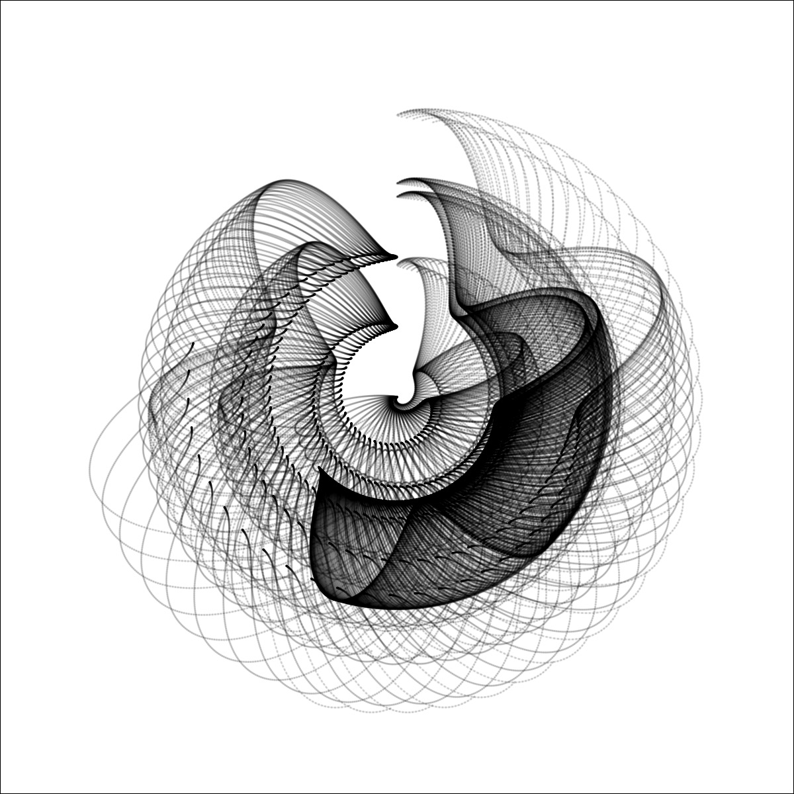



# Nerd

The cool thing about science is that you can have a lot of fun with it!

### Wizarding School House Sorting Test 

... some time ago, in an MSc Psychology course on Psychometrics, four friends and I were told that, as assignment for the course, we could basically construct any psychological test we're interested in. Really any construct? Sure. 

We constructed the test to sort individuals into four houses of a wizarding school based on existing psychological personality trait questionnairs - BUT - the items were translated from the original German versions of the scales, some were adapted and a few items were created to cover the full range of character traits identified in the famous novels that we all grew up with. For sure, I made some coding errors when developing this app! Therefore, this is NOT a serious personality test in any way. 

We do not pursue any commercial interests. We were simply so excited about our project, that years after the course, people kept asking us to launch the survey again because "a friend of a friend would like to know their house too". In fact, we did this several times - launched the survey via a third party service and analyzed the data with a buggy R-Script, again and again. Therefore, I decided to make this test my first R-Shiny project.
In case you have further question, take a look at the [code](https://github.com/lfoswald/housesortingtest/blob/main/app.R){:target="_blank"} or feel free to contact me. Plese enjoy it with a pinch of salt - and share it with your fellow wizards!

[Take the test and find out your house!](https://oswald.shinyapps.io/hogwartshouses/){:target="_blank"} 🦉

___

### Generative Art in R

  
   
  
  
   
  

If you haven't done so yet, I highly recommend experimenting with [Katharina Brunner's](https://katharinabrunner.de/2018/11/generative-art-many-thousands-points-can-form-beautiful-images/){:target="_blank"} generative art package in R! Shapes are created by transforming the coordinates of points with sinus and cosinus fuctions, for example. 

___

In case you still have too much time, here are some podcast and reading recommendations.

### Listen

* Coping with the replication crisis in psychology (and more fun stuff) [Two psychologists four beers](https://www.fourbeers.com/){:target="_blank"} 🇨🇦
* Internet and politics from the OII [Skeptechs](https://oxpod.net/skeptechs/){:target="_blank"} 🇬🇧
* Rap and politics [Machiavelli](https://www1.wdr.de/radio/cosmo/podcast/machiavelli/index.html){:target="_blank"} 🇩🇪

### Read 

* New to computational social science? [Bit by Bit](https://www.bitbybitbook.com/){:target="_blank"}
* Coming up with social science research questions? [Methods of discovery](https://www.thalia.de/shop/home/artikeldetails/ID6792127.html){:target="_blank"}
* Technology is not the solution to everyting? [The smart enough city](https://mitpress.mit.edu/books/smart-enough-city){:target="_blank"}
* Psychology is not the solution to everyting? [The quick fix](https://www.thalia.de/shop/home/artikeldetails/ID149757965.html){:target="_blank"}
* What's going on with the internet and US politics? [Breaking the social media prism](https://press.princeton.edu/books/hardcover/9780691203423/breaking-the-social-media-prism){:target="_blank"}
* Why was climate change a problem again and since when do we know? [Limits to growth](https://www.clubofrome.org/publication/the-limits-to-growth/){:target="_blank"}
* Cities are more than a collection of buildings? [Building and Dwelling](https://www.thalia.de/shop/home/artikeldetails/ID40475822.html){:target="_blank"}
* Why do we travel and does that make sense at all? [The art of travel](https://www.thalia.de/shop/home/artikeldetails/ID38976532.html?ProvID=11000522&gclid=CjwKCAjw-e2EBhAhEiwAJI5jg6t-7G1o534MNoy7xRovOfhgDLaiutFEeW-LOAdC7tjxD1C-_qHRZhoCJWgQAvD_BwE){:target="_blank"}
* Why is everyone talking about causal inference? [The book of why](http://bayes.cs.ucla.edu/WHY/){:target="_blank"}
* What does feminism have to do with data? [Invisible women](https://www.thalia.de/shop/home/artikeldetails/ID144042836.html?ProvID=10907020&gclid=CjwKCAjw-e2EBhAhEiwAJI5jg_Ele7qEFYpHrrNLL12l-I4yk734TzkQKdkhijBmfHf4_sPgME3toRoCCzEQAvD_BwE&gclsrc=aw.ds){:target="_blank"}
