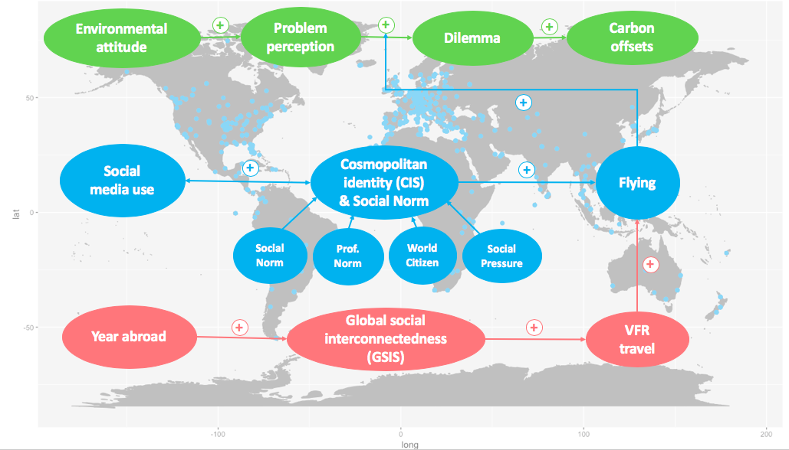
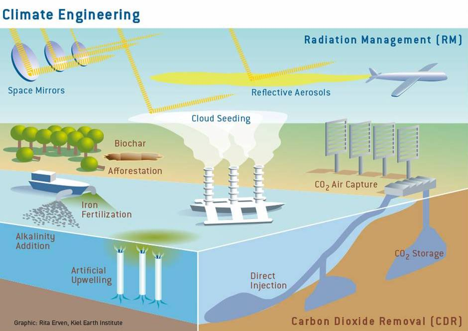



Oswald, L., & Ernst, A. (2020). Flying in the Face of Climate Change: Quantitative psychological approach examining the social drivers of individual air travel, Journal of Sustainable Tourism, DOI: 10.1080/09669582.2020.1812616
[Find paper here](https://www.tandfonline.com/doi/full/10.1080/09669582.2020.1812616)
and get free access with this [eprint link](https://www.tandfonline.com/eprint/HHT88G9HSMFPMRB5UWP3/full?target=10.1080/09669582.2020.1812616)

Klaus, G., Ernst, A., & Oswald, L. (2020). Psychological factors influencing laypersons’ acceptance of climate engineering, climate change mitigation and business as usual scenarios. Technology in Society, 60, 101222.
[Find paper here](https://www.sciencedirect.com/science/article/pii/S0160791X1930137X)

